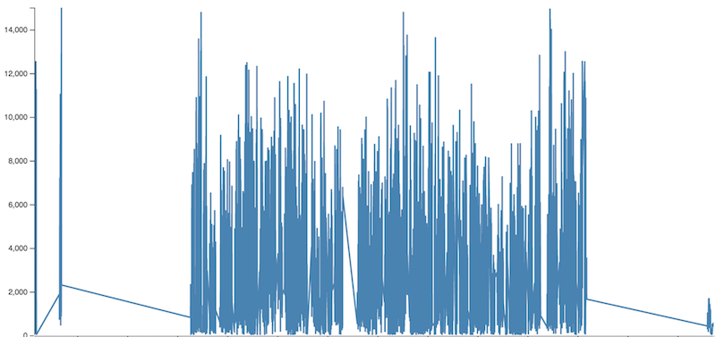
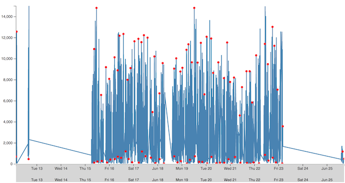
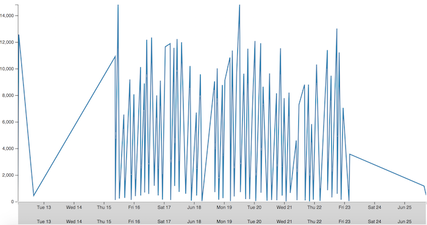

# Downsampling in JavaScript

# Problem statement

Have you ever had a situation in which you needed to render a chart or a grid with hundreds of thousands of data points?
Sucks, doesn't it? The API takes too long to respond, the UI takes too long to load and the whole page temporarily hangs.

That's neither ideal nor what we'd want to do in the first place.

Let us take an example here: 

Would you look at that! Do we really need to show that condensed blue area where the points are so close to each other that they all merge and show up as a 
single block of color? What is our user supposed to take away from this? Can you add tooltips to these points and somehow try to give some context when they hover on it? 

Sure you can, but with so many points it is just like a needle in a haystack.

### How do we solve problems like these?

What if there was a way for us to represent the intent of these 100,000 points by using only 1000 data points at the most. 
How do we condense our original data set of 100,000 points into a concise and compact data set which still accurately represents what we need?

#### Option 1

Should we aggregate the points by grouping them into groups of 100 and take some sort of a mean value?
Well, yeah that's one way to do it. But would that aggregated data set be accurate enough to truly represent our original data set?

Probably not. You can think of it this way, lets say you have 99 points that have similar values while one point turns out to be an anomaly. 
When you try to aggregate these points by taking the mean you'd be losing out on the outliers, giving us a skewed picture that everything is fine. 
But who cares if everything is fine, we care about the failures, the anomalies, the outliers that need fixing. So this solution can be outright discarded.

#### Option 2

Ok how about we group them by date (or whatever our x-axis is) and then try to reduce to, say 1 point per day. Would that solve our problem? 

Probably not again. Lets say you have 500 data points generated within a day while you have hardly 10 points generated across the next 10 days. 
Now if we start grouping these points on a per day basis we'd end up with hardly any points on the chart. Those 500 points have condensed to just one. 
Seriously? Where's my data?  

#### Option 3

Enough cribbing now, time to pull out the big guns to attack this monster. 
Let us take a moment to introduce you to `The largest triangle three bucket downsampling algorithm`

###### Ok, this sounds interesting. What does it do? 

This algorithm helps in condensing a huge dataset such that the crucial trends are maintained as is.

###### How are the trends maintained?

Lets say you're given a 5000 point dataset that needs to be condensed to 500 data points. 
We divide these points into 500 buckets of 10 points each. Then we look to include the points (one from each bucket) that are 
farthest apart from each other iterating over one bucket at a time. 

###### How do we determine points that are farthest apart?

Triangles! Yes, we form triangles and include points that result in the largest area. 

###### What if the points after downsampling are really sparse and I would like a denser dataset?

Well we can always choose to recursively apply downsampling to the data points until we've reached our desired density. 

Sounds pretty kickass doesn't it. Following is the implementation to blow your mind further.

### Implementing Downsampling

* The first point goes into the first bucket and the last point goes into the last bucket of the dataset. 
  The rest of the points are spread evenly across intermediary buckets.

*  Now take the only point in bucket 1, the average X and Y values of all points in bucket 3 and
calculate the area of the triangle which these two points can form with each of the points in bucket 2.

* Which ever point from bucket 2 forms the largest area becomes a new addition to the resultant data list.
In the next iteration, the chosen point from bucket 2 would be used to determine the point from bucket 3. This process continues until the end of the threshold (same as the total number of
points requested from UI);

### Analysis Of Results

Before downsampling: 

After downsampling: 

Tada! Look at how we have taken a seemingly dense mass of data and have transformed it into a chart that presents us with useful insights without any compromise on valuable trends.

## Conclusion

As you can see the largest triangle three bucket downsampling algorithm is pretty efficient in condensing large datasets into  smaller ones but maintains the trends depicted by the original dataset.

### References:

* https://skemman.is/bitstream/1946/15343/3/SS_MSthesis.pdf
* https://github.com/sveinn-steinarsson/flot-downsample/blob/master/jquery.flot.downsample.js